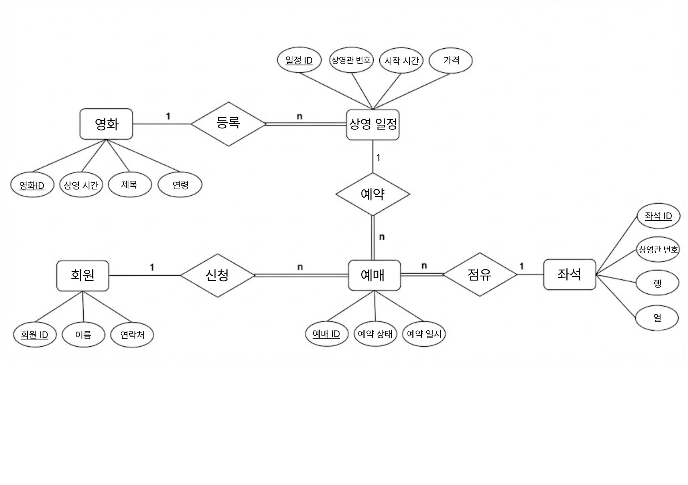
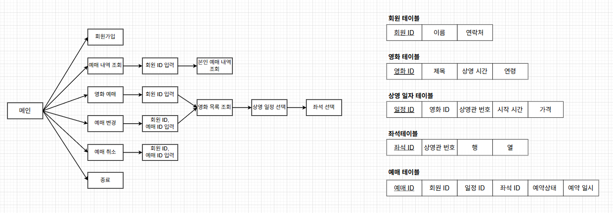

# 🎬 Cinema-DB-Modeling (영화 예매 시스템)

## 📖 Project Overview
이 프로젝트는 영화 예매 서비스를 위한 **관계형 데이터베이스(RDBMS) 설계 및 구현** 프로젝트입니다.
실제 서비스 가능한 수준의 정규화된 테이블을 설계하고, 데이터 무결성을 보장하는 제약조건(Constraints)을 정의하는 데 중점을 두었습니다.

* **개발 환경:** Oracle Database 19c, C (Pro*C)
* **핵심 내용:** ER-Modeling, 논리/물리적 데이터베이스 설계, 트랜잭션 제어

## 💡 Development Note (개발 주안점 및 구조)
이 프로젝트는 **데이터베이스 모델링(Logical/Physical Design)**과 **Pro*C를 이용한 트랜잭션 제어**를 학습하는 데에 주안점을 두었습니다.

* **Monolithic Source Code:**
    * 본 프로젝트는 Oracle Embedded SQL(Pro*C)의 전처리 및 컴파일 과정을 단순화하고, **SQL 트랜잭션의 흐름(Connect → Query → Commit/Rollback)**을 한눈에 파악하기 위해 의도적으로 단일 파일(`proc_sample_all.pc`)로 구성했습니다.
    * 실제 프로덕션 레벨이나 추후 고도화 단계에서는 **MVC 패턴**을 적용하여 UI, 비즈니스 로직, DB 접근 계층(DAO)을 분리할 계획입니다.

---

## 🏗️ Database Modeling
데이터의 중복을 최소화하고 무결성을 유지하기 위해 핵심 엔티티 간의 관계를 정의했습니다.

### 1. ER Diagram (Logical Design)
회원, 영화, 상영 일정, 좌석 간의 관계(Relationship)와 카디널리티(Cardinality)를 정의한 ER 다이어그램입니다.

### 2. Physical Schema & Process Flow
논리적 설계를 바탕으로 도출된 물리적 스키마 구조와 시스템의 주요 프로세스 흐름도입니다.

---

## 📑 Table Specifications (테이블 명세)
총 5개의 핵심 테이블(**USERS, MOVIES, SCHEDULES, SEATS, BOOKINGS**)에 대한 상세 명세입니다.

### 1. USERS (회원)
영화 예매 서비스를 이용하는 사용자의 식별 정보와 연락처를 관리합니다.

| Attribute | Data Type | Null | Key | Description |
|:---:|:---:|:---:|:---:|:---|
| **USER_ID** | NUMBER | N | **PK** | 회원 ID (식별자) |
| NAME | VARCHAR2(50) | Y | | 이름 |
| CONTACT | VARCHAR2(20) | Y | | 연락처 (010-XXXX-XXXX) |

* **Constraints**
    * `PK`: USERS_USER_ID_PK
    * `CHECK`: 연락처 형식이 `010-0000-0000` 패턴인지 정규식 검증 (`REGEXP_LIKE`)

### 2. MOVIES (영화)
영화의 기본 정보(제목, 관람 등급, 상영 시간 등)를 정의하고 관리하는 정적 테이블입니다.

| Attribute | Data Type | Null | Key | Description |
|:---:|:---:|:---:|:---:|:---|
| **MOVIE_ID** | NUMBER | N | **PK** | 영화 ID |
| TITLE | VARCHAR2(100) | Y | | 영화 제목 |
| RATING | VARCHAR2(20) | N | | 관람 등급 |
| DURATION | NUMBER | Y | | 상영 시간 (분) |

* **Constraints**
    * `PK`: MOVIES_MOVIE_ID_PK
    * `CHECK`: 상영 시간(`DURATION`)은 0보다 커야 함

### 3. SEATS (좌석)
각 상영관에 배치된 물리적인 좌석 위치(행, 열) 정보를 관리합니다.

| Attribute | Data Type | Null | Key | Description |
|:---:|:---:|:---:|:---:|:---|
| **SEAT_ID** | NUMBER | N | **PK** | 좌석 ID |
| SCREEN_NO | VARCHAR2(20) | Y | | 상영관 번호 |
| ROW_CODE | NUMBER | Y | | 행 코드 |
| COL_CODE | NUMBER | Y | | 열 코드 |

* **Constraints**
    * `PK`: SEATS_SEAT_ID_PK

### 4. SCHEDULES (상영 일정)
특정 영화가 언제, 어느 상영관에서 상영되는지와 티켓 가격 정보를 관리합니다.

| Attribute | Data Type | Null | Key | Description |
|:---:|:---:|:---:|:---:|:---|
| **SCHEDULE_ID** | NUMBER | N | **PK** | 일정 ID |
| **MOVIE_ID** | NUMBER | N | **FK** | 영화 ID |
| SCREEN_NO | VARCHAR2(10) | Y | | 상영관 번호 |
| START_TIME | VARCHAR2(10) | Y | | 시작 시간 |
| PRICE | NUMBER | N | | 티켓 가격 |

* **Constraints**
    * `PK`: SCHEDULES_SCHEDULE_ID_PK
    * `FK`: SCHEDULES_MOVIE_ID_FK (References MOVIES)
    * `CHECK`: 가격(`PRICE`)은 0 이상이어야 함

### 5. BOOKINGS (예매)
회원이 특정 상영 일정과 좌석을 선택하여 결제한 예매 내역(트랜잭션)을 관리합니다.

| Attribute | Data Type | Null | Key | Description |
|:---:|:---:|:---:|:---:|:---|
| **BOOKING_ID** | NUMBER | N | **PK** | 예매 ID |
| **USER_ID** | NUMBER | N | **FK** | 회원 ID |
| **SCHEDULE_ID** | NUMBER | N | **FK** | 일정 ID |
| **SEAT_ID** | NUMBER | N | **FK** | 좌석 ID |
| STATUS | VARCHAR2(10) | Y | | 예약 상태 |
| CREATED_AT | DATE | Y | | 예약 일시 (Default: SYSDATE) |

* **Constraints**
    * `PK`: BOOKINGS_BOOKING_ID_PK
    * `FK`: BOOKINGS_USER_ID_FK, BOOKINGS_SEAT_ID_FK, BOOKINGS_SCHEDULE_ID_FK
    * `CHECK`: 예약 상태는 `'결제완료', '취소됨', '예약중'` 중 하나여야 함

---

## 💻 Key Implementation Features (구현 핵심)
* **Transaction Management:** `INSERT/UPDATE` 수행 후 `sqlca.sqlcode`를 확인하여 성공 시 `COMMIT`, 실패 시 `ROLLBACK` 처리.
* **Dynamic Query:** `Bookings`, `Schedules`, `Movies`, `Seats` 4개 테이블을 조인(Join)하여 사용자가 보기 편한 형태로 예매 내역을 출력.
* **Duplicate Prevention:** 예매 시도 시, 해당 일정 및 좌석의 중복 여부를 `SELECT count(*)` 쿼리로 사전 검증하여 데이터 무결성 보장.

---

## 📂 Detailed Report
데이터베이스 설계 과정, 정규화 수행 내역, 상세 SQL 트랜잭션 로직 등 더 자세한 내용은 아래 결과 보고서를 통해 확인하실 수 있습니다.

[📄 **DB응용프로젝트결과보고서.pdf** (클릭하여 보기)](./DB응용프로젝트결과보고서.pdf)
